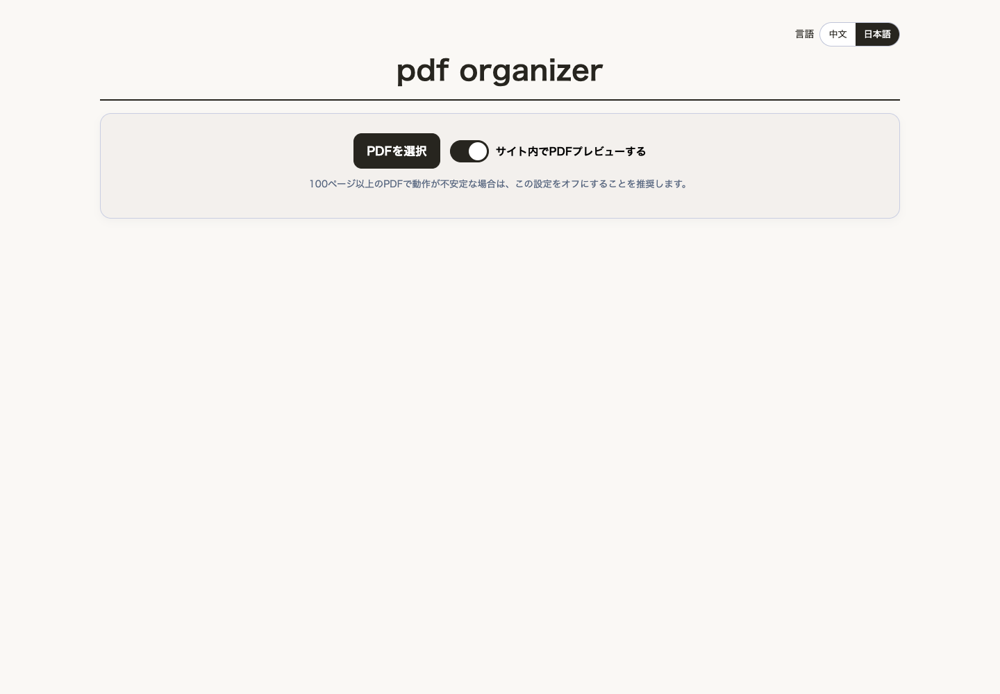

# PDF Organizer

PDF Organizer is a privacy-friendly PDF editing tool that runs entirely in your browser. PDF files are processed on your device and are not uploaded to an application server.

ブラウザだけで動作する、プライバシー重視のPDF編集ツールです。選択したPDFは端末内で処理され、アプリケーションサーバーにはアップロードされません。

[公開サイトを開く](https://pdfs-six.vercel.app)



## 機能

- ページの並べ替え、選択、削除
- 先頭、ページ間、末尾への空白ページ追加
- 並べ替え後または選択ページのみのPDF書き出し
- `1-3,4-6,7` のような範囲指定による分割ZIP出力
- 2ページを横に並べる見開き変換
- 左綴じ、右綴じの切り替え
- パスワード付きPDFの読み込みと変換
- 日本語、中国語表示

## プライバシー

- PDFの読み込み、編集、書き出しはブラウザ内で行います。
- PDF本体や入力したPDFパスワードを外部へ送信するコードはありません。
- アクセス解析や広告SDKは使用していません。
- `localStorage`には表示言語の設定だけを保存します。
- 公開サイトへの通常のHTTPアクセス情報は、ホスティング事業者であるVercelによって処理されます。

## 対応環境と制約

最新のChrome、Edge、Firefox、Safariを対象にしています。iOSではblob URLを使ったプレビューが不安定なため、サイト内プレビューを無効化しています。

- 大きなPDFや画像の多いPDFは端末メモリを多く消費します。
- 保護されたPDFの互換変換では各ページを画像化するため、テキスト選択、検索、元PDFの最適化情報は保持されません。
- 内容を編集する権限のあるPDFだけを処理してください。

## ローカル開発

Node.js 22.13以降を推奨します。

```bash
npm ci
npm run dev
```

本番用ビルドを確認するには次を実行します。

```bash
npm run build
```

出力先は `dist/` です。Vercelでは `vercel.json` のVite設定を利用できます。

## コントリビューションとサポート

不具合報告や改善提案を歓迎します。作業を始める前に [CONTRIBUTING.md](CONTRIBUTING.md) を確認してください。利用方法の質問は [SUPPORT.md](SUPPORT.md)、脆弱性の報告は [SECURITY.md](SECURITY.md) を参照してください。

## ライセンス

[MIT License](LICENSE)

<!-- auto-merge precondition check -->
